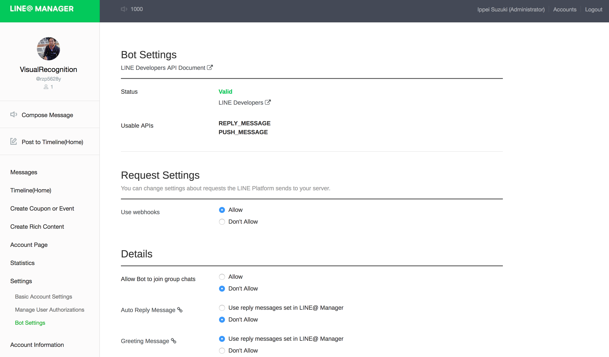

# LINE BOT - Watson Visual Recognition  

## 更新履歴
### version 1.0.4
* 組織都合によりプッシュ先のスペースを移動しました。
* モジュールの最新化、ECMAScript 6 対応をしました。

### version 1.0.3
* Statica は LINE Messaging API の前提では無いため廃止しました。 
* LINE Messaging API・Get Content の結果の一部である headers の内容が変わりました。これまでは content-disposition からファイル名を取得してましたが、値がなくなったため、x-line-request-id とコンテントタイプからファイルパスを作成するように変更しました。   

### 障害に伴う暫定対応 2016/12/2
* Statica 経由での LINE Messaging API アクセスが 403エラーとなる。Starica の IP アドレスがアクセス毎に変動している模様。アプリの Proxy 設定をコメントアウト、LINE のホワイトリストを全て削除したところ現在は正常に動作している。あれっ？ホワイトリストと Statica は不要だったかな？？

### version 1.0.2
* LINE Messaging API 対応をしました。    

### version 1.0.1
* 各環境のサービス名統一が難しいため、接続情報をVCAP_SERVICESの配列順で取得するように変更しました。  
* 確認用にテストページ (ステータス200「OK」) を作成しました。  
* 顔認識 (detectFaces) 以外に、クラス分類 (Classify) 機能を追加しました。
* 上記に伴い、画像解析のモード変更のため、テキストメッセージによるコマンドを実装しました。

## はじめに  
LINE に顔写真を送信することで、その人にお勧めな情報を提示するという話から、IBM Bluemix の Visual Recognition で 顔の判定をして結果 (JSON) を返す CF アプリを実装しました。


## 使い方
LINE アプリの友だち追加で、以下の QR コードを読み込ませてください。  


実行結果を以下に示します。

  

コマンド一覧を下表に示します。  
モードは utils/context.js のグローバル変数で定義しており、設定変更のスコープはアプリケーションです。実運用時にはユーザやセッション毎にするなどの工夫が必要です。  

|コマンド                    |内容                       |
|--------------------------|---------------------------|
|cmd:help                  |コマンド一覧を表示する。        |
|cmd:showSetting           |解析モードを表示する。         |
|cmd:recognizeMode=faces   |解析モードを顔認識に設定する。   |
|cmd:recognizeMode=classify|解析モードをクラス分類に設定する。|


## セットアップ  
1. 本サイトから line-bot アプリをダウンロード (Download ZIP) して解凍してください。ディレクトリ名は line-bot-master から line-bot に変更してください。

1. Bluemix コンソールにログインしてください。ここでは次の条件で説明をします。ご自身のアカウント情報に読替えて手順を進めてください。
    - Region: United Kingdom
    - Organization: jiec_rd
    - Space: dev

1. Bluemix コンソールで CFアプリケーション (Node.js) を作成してください。以下の ippei0605 はご自身のユーザ名などに変更してください。  
アプリケーション名: line-bot-ippei0605 (任意)  

    > 以降、line-bot-ippei0605 で説明します。

1. PC に CF コマンド・ライン・インターフェースをインストールしていない場合は、インストールしてください。 (Bluemix コンソール、アプリケーション内の開始 (Getting Started) メニューにダウンロードボタンがあります。)

1. Bluemix コンソールで Visual Recognition を作成し、line-bot-ippei0605 にバインドしてください。  
    - サービス名: 任意
    - プラン: 任意 (本アプリでは Free を選択)

1. 以下のサイトで LINE アカウントを登録してください。
https://business.line.me/ja/

1. LINE@MANAGER で Bot の設定をしてください。


1. LINE BOT Basic Information を以下に示します。画面をスクロールさせ、Webhook URLに  	
https://line-bot-ippei0605.mybluemix.net:443/callback を設定してください。環境変数の設定のために、Channel Access Token の値を取得してください。


1. LINE BOT Server IP Whitelist は、Statica Dashboard の Setup に示されている Your Static IPs を登録してください。
  

1. Bluemix コンソールから CF アプリの環境変数 (ユーザー定義) を設定します。LINE BOT Basic Information の Channel Access Token を定義してください。
  

1. PC のターミナルソフトを起動してください。 (私は IntelliJ IDEA や Eclipse のターミナルを使っていますが、Windows の cmd 、Mac の　ターミナルなどで操作できます。)

1. ターミナルで、解凍したディレクトリ (line-bot アプリのホーム) に移動してください。 (コマンドは以下、$はコマンドプロンプトです。)
    ```
    $ cd line-bot
    ```

1. ターミナルで、Bluemixに接続してください。
    ```
    $ cf api https://api.eu-gb.bluemix.net
    ```

1. ターミナルで、Bluemix にログインしてください。
    ```
    $ cf login -u ippei0605@gmail.com -o jiec_rd -s dev
    ```

1. ターミナルで、アプリをデプロイしてください。
    ```
    $ cf push line-bot-ippei0605
    ```

## アプリの構成

[LINE]<-->[LINE BOT]<-->[Bluemix Node.js]<-->[Bluemix Visual Recognition]

## ファイル構成  
    line-bot
    │  .cfignore
    │  .gitignore
    │  app.js                 LINE BOT アプリ
    │  package.json
    │  readme.md
    │  
    ├─docs
    │      bot-settings.png   readme.md の図: LINE@MANAGER Bot 設定
    │      env.png            readme.md の図: 環境変数 (ユーザー定義)
    │      line-basic.png     readme.md の図: LINE Basic Information
    │      line-whitelist.png readme.md の図: LINE Server IP Whitelist
    │      qr-code.png        readme.md の図: QR Code
    │      sample.jpg         readme.md の図: 実行結果
    │
    ├─public
    │      favicon.ico
    │      
    ├─routes
    │      index.js           LINE BOT アプリのルーティング
    │      
    └─utils
           context.js         LINE BOT アプリのコンテキスト

## ルート (URLマッピング)  
|Action|Method|処理|
|---------|----|-----------|
|/        |GET |テストページ (ステータス200「OK」)| 
|/callback|POST|LINE から呼び出されるコールバック。LINEに送付したメッセーの種類により次を実行する。(1)テキストの場合、コマンド処理、コマンド以外の場合は「会話は勉強中」と回答する。(2)イメージの場合、認識モードにより顔認識かクラス分類を呼出す。(3)その他の場合は、「顔写真を送ってください。」と回答する。|

## まとめ (・・・というかハマった箇所)
- LINE との接続には Request モジュールを使用しました。イメージを取得する際 (LINE Getting Message Content) は {encoding: null} を指定しないと正しいデータが取得できません。 (デフォルト utf-8変換されるため。)
- Visual Recognition は直接バイナリデータを扱えません。LINE から取得したイメージ (バイナリ) は一旦 Bluemix 環境に保存して、その時のファイル名からリードストリームを作成してVisual Recognition に渡しています。LINE BOT との連携は向いてないと思いました。 
- LINE Messaging API 対応において、当初 Sending message (v1, events) を Reply message (v2, reply-message) に置き換えましたが、返信するとトークンが削除されるようで、段階的に返信したり、コンテンツを取得したい場合には向いてません。よって、Push message (v2, push-message) に置き換えてます。
- 以前は Server IP Whitelist にコールバック・アプリケーション の固定 IP アドレスを設定する必要がありました。Bluemix CF アプリの IP アドレスは起動毎に変わってしまい固定できませんので、次のサイトを参考に Bluemix のサービス「Statica」(3rd party) を使用して Proxy を構成しました。現在は Whitelist は空 (任意の IP) も設定可能です。
- http://dotnsf.blog.jp/archives/2016-04-15.html
