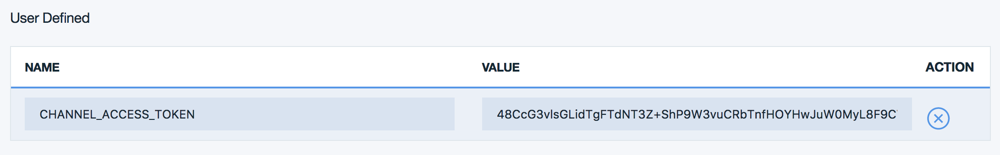

# LINE BOT - Watson Visual Recognition  

## 更新履歴
### version 1.0.1
* 各環境のサービス名統一が難しいため、接続情報をVCAP_SERVICESの配列順で取得するように変更しました。  
* 確認用にテストページ (ステータス200「OK」) を作成しました。  
* 顔認識 (detectFaces) 以外に、クラス分類 (Classify) 機能を追加しました。
* 上記に伴い、画像解析のモード変更のため、テキストメッセージによるコマンドを実装しました。

## はじめに  
LINE に顔写真を送信することで、その人にお勧めな情報を提示するという話から、IBM Bluemix の Visual Recogniton で 顔の判定をして結果 (JSON) を返す CF アプリを実装しました。

LINE BOT は Server IP Whitelist にコールバック・アプリケーションのIP アドレスを設定します。しかし、CFアプリの IP アドレスは起動毎に変わってしまい、固定にできません。そこで、次のサイトを参考に、Bluemix のサービス「Statica」(3rd party) を使用して Proxy を構成しました。 (師匠ありがとうございます。)  
- http://dotnsf.blog.jp/archives/2016-04-15.html

## 使い方
LINE アプリの友だち追加で、以下の QR コードを読み込ませてください。  

  

実行結果を以下に示します。

  

コマンド一覧を下表に示します。  
モードは utils/context.js のグローバル変数で定義しており、設定変更のスコープはアプリケーションです。実運用時にはユーザやセッション毎にするなどの工夫が必要です。  

|コマンド                    |内容                       |
|--------------------------|---------------------------|
|cmd:help                  |コマンド一覧を表示する。        |
|cmd:showSetting           |解析モードを表示する。         |
|cmd:recognizeMode=faces   |解析モードを顔認識に設定する。   |
|cmd:recognizeMode=classify|解析モードをクラス分類に設定する。|

## セットアップ  
1. 本サイトから line-bot アプリをダウンロード (Download ZIP) して解凍してください。ディレクトリ名は line-bot-master から line-bot に変更してください。

1. Bluemix コンソールから CFアプリケーション (Node.js) を作成してください。以下の ippei0605 はご自身のユーザ名などに変更してください。  
アプリケーション名: line-bot-ippei0605 (任意)  

    > 以降、line-bot-ippei0605 で説明します。

1. CF コマンド・ライン・インターフェースをインストールしていない場合は、インストールしてください。

1. Statica を作成し、line-bot-ippei0605 にバインドしてください。  
サービス名: line-bot-statica (任意)  

1. Visual Recognition を作成し、line-bot-ippei0605 にバインドしてください。  
サービス名: line-bot-visual-recognition (任意)  

1. 以下のサイトから、BOT API Trial Account を登録してください。  
https://business.line.me/services/products/4/introduction

1. LINE BOT Basic Information を以下に示します。

1. LINE BOT Server IP Whitelist は、Statica Dashboard の Setup に示されている Your Static IPs を登録してください。
  

1. Bluemix コンソールから CF アプリの環境変数 (ユーザー定義) を設定します。LINE BOT Basic Information に従って設定してください。
    - CHANNEL_ID : Channel ID
    - CHANNEL_SECRET : Channel Secret
    - MID : MID
      

1. 解凍したディレクトリ (line-bot アプリのホーム) に移動してください。

        > cd line-bot

1. Bluemixに接続してください。

        > cf api https://api.ng.bluemix.net
    

1. Bluemix にログインしてください。

        > cf login -u e87782@jp.ibm.com -o e87782@jp.ibm.com -s dev

1. アプリをデプロイしてください。

        > cf push line-bot-ippei0605

## アプリの構成

[LINE]<-->[LINE BOT]<-->[Bluemix Statica]<-->[Bluemix Node.js]<-->[Bluemix Visual Recognition]

## ファイル構成  
    line-bot
    │  .cfignore
    │  .gitignore
    │  app.js                 LINE BOT アプリ
    │  manifest.yml
    │  package.json
    │  readme.md
    │  
    ├─docs
    │      env.png            readme.md の図: 環境変数 (ユーザー定義)
    │      line-basic.png     readme.md の図: LINE Base Information
    │      line-whitelist.png readme.md の図: LINE Server IP Whitelist
    │      qr.png             readme.md の図: QR Code
    │      sample.jpg         readme.md の図: 実行結果
    │
    ├─public
    │      favicon.ico
    │      
    ├─routes
    │      index.js           LINE BOT アプリのルーティング
    │      
    └─utils
           context.js         LINE BOT アプリのコンテキスト

## ルート (URLマッピング)  
|Action|Method|処理|
|---------|----|-----------|
|/        |GET |テストページ (ステータス200「OK」)| 
|/callback|POST|LINE から呼び出されるコールバック。LINEに送付したメッセーの種類により次を実行する。(1)テキストの場合、コマンド処理、コマンド以外の場合は「会話は勉強中」と回答する。(2)イメージの場合、認識モードにより顔認識かクラス分類を呼出す。(3)その他の場合は、「顔写真を送ってください。」と回答する。|

## まとめ (・・・というかハマった箇所)
- LINE との接続には Request モジュールを使用しました。イメージを取得する際 (LINE Getting Message Content) は {encoding: null} を指定しないと正しいデータが取得できません。 (デフォルト utf-8変換されるため。)
- Visual Recognition は直接バイナリデータを扱えません。LINE から取得したイメージ (バイナリ) は一旦 Bluemix 環境に保存して、その時のファイル名からリードストリームを作成してVisual Recognition に渡しています。LINE BOT との連携は向いてないと思いました。 